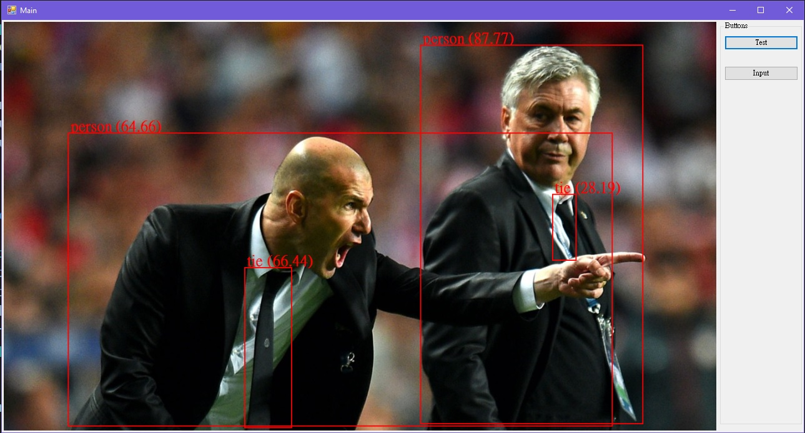
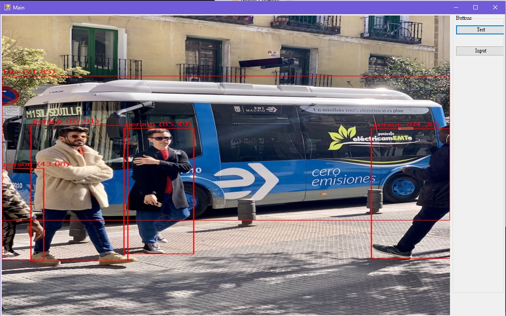

# C# YoloV5 Torch
Run [Ultralytics's YoloV5](https://github.com/ultralytics/yolov5) in C# by using [LibTorch](https://pytorch.org/cppdocs/)  
The C++ part of this project is highly reference to [ncdhz's C++ YoloV5 Library](https://github.com/ncdhz/YoloV5-LibTorch)  

  

 

# How to use the libarary on C#:  
can reference to:  YoloV5TorchTest/YoloV5TorchTest  

# Run without Compile Library  
Download libtorch-win-shared-with-deps-1.10.2+cu113  
Download opencv 4.6.0  
Download and install cuda 11.3  
Get YoloV5Torch.dll from YoloV5TorchTest/YoloV5TorchTest/  
Get YoloV5TorchCpp.dll from YoloV5TorchTest/YoloV5TorchTest/  
Create a C# program and add YoloV5Torch.dll to the reference  

All dll from (libtorch-win-shared-with-deps-1.10.2+cu113/libtorch/lib) &  
opencv/build/x64/vc15/bin/opencv_world460.dll &  
YoloV5Torch.dll &  
YoloV5TorchCpp.dll  
should put in the same directory as your C# program  

# Build Library  
## YoloV5Torch:  
YoloV5Torch can directly build  

## YoloV5TorchCpp:  
Download libtorch  
Download opencv  
Download and install cuda with version same as libtorch  

### Add Additional include directories:  
{cudaDirectory}/include  
{libtorchDirectory}/libtorch/include  
{libtorchDirectory}/libtorch/include/torch/csrc/api/include  
{opencvDirectory}/build/include/  

### Add Additional libraryy directories:  
{cudaDirectory}/lib/x64  
{libtorchDirectory}/libtorch/lib  
{opencvDirectory}/build/x64/vc15/lib  

### Add Additional Dependencies:  
opencv_world460.lib  
AND  
All .lib from {libtorchDirectory}/libtorch/lib  

# Libraries in C++  
LibTorch (1.10.2+cu113)  
OpenCv (4.6.0)  
Cuda (11.3)  

# Reference  
https://github.com/ultralytics/yolov5  
https://github.com/ncdhz/YoloV5-LibTorch